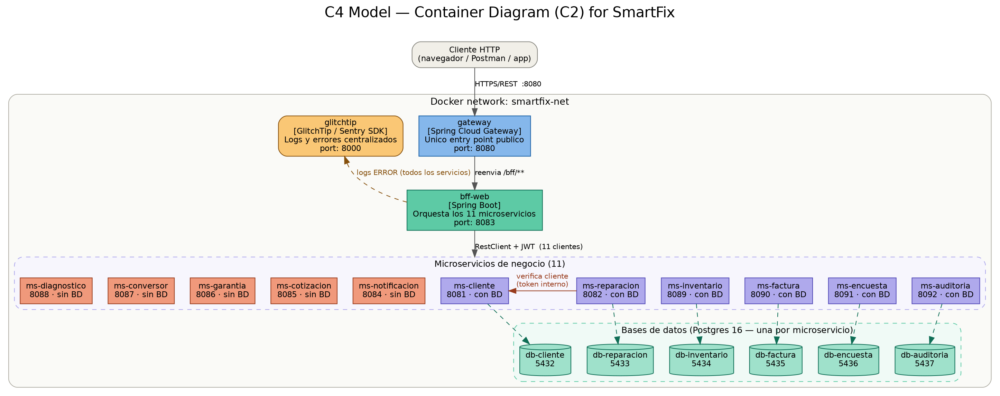
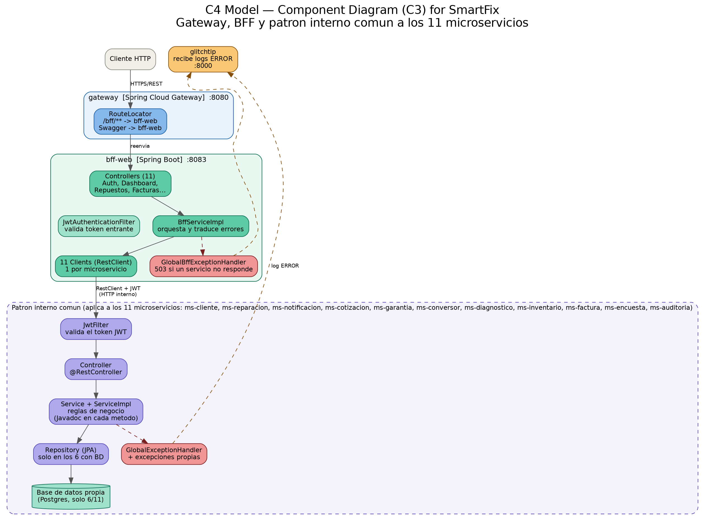

# Smartfix

Sistema de gestion de reparaciones tecnicas construido con una arquitectura de microservicios en Spring Boot. Permite registrar clientes, administrar el ciclo de vida de una reparacion y autenticar usuarios mediante JWT, todo orquestado a traves de un BFF (Backend For Frontend).

---

## Tabla de contenidos

- [Arquitectura general](#arquitectura-general)
- [C1 — Microservicios base](#c1--microservicios-base)
- [C2 — BFF, seguridad y testing](#c2--bff-seguridad-y-testing)
- [Modulos del proyecto](#modulos-del-proyecto)
- [Stack tecnologico](#stack-tecnologico)
- [Como ejecutar el proyecto](#como-ejecutar-el-proyecto)
- [Documentacion interactiva (Swagger)](#documentacion-interactiva-swagger)
- [Testing](#testing)
- [Seguridad](#seguridad)
- [Estructura de carpetas](#estructura-de-carpetas)

---

## Arquitectura general

Smartfix esta dividido en 13 componentes independientes:

| Servicio | Puerto | DB propia | Responsabilidad |
|---|---|---|---|
| `gateway` | 8080 | No | **Unico punto de entrada publico** del sistema. Reenvia todo al BFF |
| `bff-web` | 8083 | No | Orquesta los 11 microservicios de negocio para el frontend |
| `ms-cliente` | 8081 | Si | Autenticacion de usuarios y CRUD de clientes |
| `ms-reparacion` | 8082 | Si | CRUD de reparaciones y su ciclo de estado |
| `ms-notificacion` | 8084 | No | Simula el envio de notificaciones EMAIL/SMS |
| `ms-cotizacion` | 8085 | No | Calcula el presupuesto estimado de una reparacion |
| `ms-garantia` | 8086 | No | Calcula el vencimiento de la garantia |
| `ms-conversor` | 8087 | No | Convierte montos CLP a otras monedas |
| `ms-diagnostico` | 8088 | No | Sugiere prioridad y tiempo estimado segun sintomas |
| `ms-inventario` | 8089 | Si | CRUD de repuestos y control de stock |
| `ms-factura` | 8090 | Si | Emision y consulta de facturas |
| `ms-encuesta` | 8091 | Si | Encuestas de satisfaccion post-reparacion |
| `ms-auditoria` | 8092 | Si | Bitacora centralizada de eventos del sistema |

Cada microservicio con base de datos tiene la suya propia (Postgres independiente); ningun microservicio comparte tablas con otro (**Database per Service**). Los microservicios sin base de datos son transformaciones o calculos puntuales sobre lo que reciben en el request.

El proyecto se desarrollo en tres etapas — **C1**, **C2** y **C3** — que se documentan por separado a continuacion.

---

## C1 — Microservicios base

Primera etapa del proyecto: construccion de los dos microservicios principales, cada uno con su propia base de datos PostgreSQL, sin conocerse entre si salvo por una llamada HTTP puntual.


**Flujo representado:**

1. Un cliente HTTP (Postman o el frontend) envia `POST /api/reparaciones` a `ms-reparacion`.
2. `ReparacionController` delega en `ReparacionServiceImpl`.
3. El service llama a `ClienteVerificacionService`, que consulta a `ms-cliente` (`GET /api/customers/{rut}`) para confirmar que el cliente existe antes de continuar.
4. Si el cliente existe, se guarda la reparacion en la base de datos de `ms-reparacion` con estado inicial `RECIBIDO`.

**Resultado de esta etapa:**
- Dos microservicios funcionando de forma independiente.
- Autenticacion con JWT en `ms-cliente` (registro y login).
- CRUD completo de clientes y de reparaciones.
- Comunicacion HTTP basica entre microservicios.

---

## C2 — BFF, seguridad y testing

Segunda etapa: se agrega el `bff-web`, que orquesta ambos microservicios para que el frontend haga una sola llamada en vez de hablar con cada servicio por separado. Tambien se refuerza la seguridad de las llamadas internas y se agregan pruebas automatizadas.



**Flujo representado:**

1. El frontend hace una unica llamada: `GET /bff/dashboard/{rut}`.
2. `DashboardController` delega en `BffServiceImpl`.
3. El BFF llama **en paralelo** (`Mono.zip()`) a `ms-cliente` y `ms-reparacion`, usando `WebClient` reactivo.
4. Internamente, cuando `ms-reparacion` necesita verificar un cliente, genera un **token JWT interno de 60 segundos** (rol `INTERNAL_SERVICE`) y lo envia a `ms-cliente`, en vez de depender de una ruta publica sin autenticacion.
5. El BFF combina ambas respuestas en un solo JSON (`DashboardResponseDTO`) y se lo entrega al frontend.

**Resultado de esta etapa:**
- `bff-web` operativo, reduciendo la complejidad del frontend.
- Comunicacion interna entre microservicios autenticada (sin rutas publicas inseguras).
- 8 pruebas automatizadas (unitarias de service y controller, mas integracion con H2).
- Documentacion interactiva con Swagger en los tres modulos.

---

## C3 — Gateway, 9 microservicios adicionales y observabilidad

Tercera etapa: se agrega un **API Gateway** como unico punto de entrada publico, 9 microservicios pequenos que complementan el negocio, y una capa de observabilidad centralizada.



**Nota:** el diagrama de contenedores (`docs/c2_diagram.png`, seccion C2 mas arriba) tambien fue actualizado para reflejar la arquitectura completa de 13 contenedores (gateway + bff + 11 microservicios + 6 bases de datos + GlitchTip).

**Regla de oro de esta etapa:** ningun cliente externo habla directo con un microservicio. Todo entra por el Gateway (puerto 8080), que reenvia al BFF (puerto interno 8083), que es el unico componente autorizado a llamar a los 11 microservicios de negocio. Los puertos individuales de cada microservicio se mantienen publicados solo para poder revisar su Swagger durante el desarrollo.

**Los 9 microservicios nuevos** se dividen en dos grupos:

- **Sin base de datos** (`ms-notificacion`, `ms-cotizacion`, `ms-garantia`, `ms-conversor`, `ms-diagnostico`): reciben datos en el request, aplican una regla o calculo, y devuelven el resultado. No necesitan persistencia.
- **Con base de datos propia** (`ms-inventario`, `ms-factura`, `ms-encuesta`, `ms-auditoria`): cada uno con su propio Postgres y sus propias migraciones Flyway, sin compartir tablas con ningun otro servicio.

**Resultado de esta etapa:**
- `gateway` (Spring Cloud Gateway, variante WebMVC) operativo como unico entry point.
- 9 microservicios nuevos, cada uno con: controller, service + interfaz documentada con Javadoc, manejo centralizado de errores con excepciones propias y `@RestControllerAdvice`, seguridad JWT, Swagger propio y tests con JaCoCo (minimo 40% de cobertura).
- El BFF ahora orquesta 11 microservicios en total (2 originales + 9 nuevos), cada uno a traves de su propio cliente HTTP (`RestClient`).
- Integracion con **GlitchTip** (alternativa open-source compatible con el SDK de Sentry) para centralizar logs de error de todos los servicios, ademas de los logs que ya se muestran por consola.

---

## Modulos del proyecto

### ms-cliente (puerto 8081)
- `POST /api/auth/register` y `/api/auth/login` — autenticacion, publico.
- `GET /POST /PUT /DELETE /api/customers` — CRUD de clientes, protegido con JWT.
- Validaciones con Bean Validation (RUT, email, telefono).
- Persistencia con Spring Data JPA + Flyway sobre PostgreSQL.

### ms-reparacion (puerto 8082)
- `POST /api/reparaciones` — crea una reparacion, verificando antes que el cliente exista.
- `GET /api/reparaciones` y `/cliente/{rut}` — listados.
- `PATCH /api/reparaciones/{id}/estado` — cambia el estado (`RECIBIDO`, `EN_PROCESO`, `LISTO`).
- Se comunica con `ms-cliente` usando un token JWT interno generado en tiempo de ejecucion.

### bff-web (puerto 8083)
- `POST /bff/auth/login` — login unificado para el frontend.
- `GET /bff/dashboard/{rut}` — combina datos de cliente y sus reparaciones en una sola respuesta.
- `/bff/clientes` — CRUD completo de ms-cliente (crear, listar, obtener, actualizar, eliminar).
- `/bff/reparaciones` — CRUD de ms-reparacion (crear, listar todas, listar por cliente, actualizar estado).
- `/bff/notificaciones`, `/bff/cotizaciones`, `/bff/garantias`, `/bff/conversor`, `/bff/diagnostico`, `/bff/repuestos`, `/bff/facturas`, `/bff/encuestas`, `/bff/auditoria` — exponen cada uno de los 9 microservicios nuevos.
- Usa `RestClient` para las llamadas HTTP a cada microservicio.
- Maneja errores de forma centralizada con `GlobalBffExceptionHandler`; si un microservicio no responde, devuelve 503 con el nombre del servicio afectado.

### gateway (puerto 8080)
- Unico punto de entrada publico del sistema (regla de oro del proyecto).
- Reenvia `/bff/**` y el Swagger del BFF hacia `bff-web`, usando Spring Cloud Gateway (variante WebMVC, mismo stack servlet que el resto del proyecto).
- No implementa logica de negocio ni seguridad propia: esa responsabilidad queda en el BFF.

### ms-notificacion (puerto 8084) — sin base de datos
- `POST /api/notificaciones/enviar` — simula el envio de una notificacion por EMAIL o SMS.

### ms-cotizacion (puerto 8085) — sin base de datos
- `POST /api/cotizaciones/calcular` — calcula el presupuesto estimado segun tipo de dispositivo, tipo de falla y urgencia.

### ms-garantia (puerto 8086) — sin base de datos
- `POST /api/garantias/calcular` — calcula la fecha de vencimiento de garantia segun el tipo de reparacion.

### ms-conversor (puerto 8087) — sin base de datos
- `GET /api/conversor/convertir` — convierte un monto en CLP a USD, EUR o ARS.

### ms-diagnostico (puerto 8088) — sin base de datos
- `POST /api/diagnostico/analizar` — sugiere prioridad de atencion y tiempo estimado segun los sintomas reportados.

### ms-inventario (puerto 8089) — con base de datos propia
- CRUD completo de repuestos (`/api/repuestos`) y ajuste de stock (`PATCH /api/repuestos/{sku}/stock`).

### ms-factura (puerto 8090) — con base de datos propia
- Emision, consulta y anulacion de facturas asociadas a una reparacion (`/api/facturas`).

### ms-encuesta (puerto 8091) — con base de datos propia
- Registro de encuestas de satisfaccion y calculo del promedio general (`/api/encuestas`).

### ms-auditoria (puerto 8092) — con base de datos propia
- Bitacora centralizada: cualquier microservicio puede registrar un evento (`POST /api/auditoria/registrar`) y consultarlo despues (`/api/auditoria`).

---

## Stack tecnologico

- **Lenguaje:** Java 25
- **Framework:** Spring Boot 4.1.0
- **Seguridad:** Spring Security + JWT (`io.jsonwebtoken`)
- **Persistencia:** Spring Data JPA + PostgreSQL + Flyway
- **Documentacion:** springdoc-openapi (Swagger UI)
- **Testing:** JUnit 5, Mockito, H2 (en memoria), JaCoCo (cobertura)
- **Comunicacion entre servicios:** `RestClient` (bff-web hacia los 11 microservicios) y `RestTemplate` (ms-reparacion -> ms-cliente)
- **Gateway:** Spring Cloud Gateway Server WebMVC (release train 2025.1.2)
- **Observabilidad:** GlitchTip (self-hosted, compatible con el SDK de Sentry) + logs por consola (Logback)
- **Contenedores:** Docker y Docker Compose

---

## Como ejecutar el proyecto

### Requisitos
- Docker y Docker Compose instalados.

### Pasos

```bash
# 1. Clonar o descomprimir el proyecto
cd Smartfix

# 2. Levantar todos los servicios (build incluido)
docker-compose up --build
```

Si la primera build falla por timeout descargando Gradle, simplemente repite el comando — la segunda vez usa cache y es mucho mas rapido.

### Servicios disponibles una vez levantado

| Servicio | URL base |
|---|---|
| **gateway (entrada publica)** | **http://localhost:8080** |
| bff-web | http://localhost:8083 |
| ms-cliente | http://localhost:8081 |
| ms-reparacion | http://localhost:8082 |
| ms-notificacion | http://localhost:8084 |
| ms-cotizacion | http://localhost:8085 |
| ms-garantia | http://localhost:8086 |
| ms-conversor | http://localhost:8087 |
| ms-diagnostico | http://localhost:8088 |
| ms-inventario | http://localhost:8089 |
| ms-factura | http://localhost:8090 |
| ms-encuesta | http://localhost:8091 |
| ms-auditoria | http://localhost:8092 |
| GlitchTip (observabilidad) | http://localhost:8000 |

### Flujo de prueba sugerido

1. `POST http://localhost:8081/api/auth/register` — crear un usuario y obtener un token JWT.
2. Usar ese token (`Authorization: Bearer <token>`) para crear un cliente en `POST /api/customers`.
3. Crear una reparacion en `POST http://localhost:8082/api/reparaciones`, referenciando el RUT del cliente creado.
4. Consultar el dashboard combinado en `GET http://localhost:8083/bff/dashboard/{rut}` (o, a traves del entry point publico, `GET http://localhost:8080/bff/dashboard/{rut}`).
5. Probar cualquiera de los 9 microservicios nuevos a traves del BFF, por ejemplo `POST http://localhost:8083/bff/cotizaciones/calcular`.

### Activar GlitchTip (opcional)

1. Levantar el stack con `docker-compose up --build` (incluye `glitchtip-web`, `glitchtip-worker`, `glitchtip-migrate`, `glitchtip-postgres` y `glitchtip-redis`).
2. Abrir `http://localhost:8000`, crear una cuenta (el registro abierto esta habilitado) y un proyecto.
3. Copiar el DSN que entrega GlitchTip para ese proyecto.
4. Definir `SENTRY_DSN=<tu-dsn>` como variable de entorno (por ejemplo en un archivo `.env` junto al `docker-compose.yml`) y volver a levantar los microservicios (`docker-compose up -d`).
5. Sin `SENTRY_DSN` definido, todos los servicios arrancan igual: el SDK simplemente queda deshabilitado.

---

## Documentacion interactiva (Swagger)

Cada microservicio expone su propia documentacion OpenAPI, pero el Swagger del **BFF es el que reune y expone a los 11 microservicios de negocio** (regla de oro del proyecto), y ademas queda accesible a traves del Gateway:

```
gateway (agrega al BFF): http://localhost:8080/swagger-ui.html
bff-web:                 http://localhost:8083/swagger-ui.html   <-- expone TODOS los microservicios

ms-cliente:               http://localhost:8081/swagger-ui.html
ms-reparacion:             http://localhost:8082/swagger-ui.html
ms-notificacion:           http://localhost:8084/swagger-ui.html
ms-cotizacion:              http://localhost:8085/swagger-ui.html
ms-garantia:                http://localhost:8086/swagger-ui.html
ms-conversor:                http://localhost:8087/swagger-ui.html
ms-diagnostico:               http://localhost:8088/swagger-ui.html
ms-inventario:                 http://localhost:8089/swagger-ui.html
ms-factura:                     http://localhost:8090/swagger-ui.html
ms-encuesta:                     http://localhost:8091/swagger-ui.html
ms-auditoria:                     http://localhost:8092/swagger-ui.html
```

Usa el boton **Authorize** en la esquina superior derecha para pegar tu token JWT y probar los endpoints protegidos directamente desde el navegador.

---

## Testing

El proyecto cuenta con **mas de 60 pruebas automatizadas** repartidas entre los 13 componentes. La estrategia es la misma en todos los microservicios nuevos, siguiendo el patron ya usado en `ms-cliente`/`ms-reparacion`:

- **Unit test — Service:** se instancia el `ServiceImpl` a mano (sin levantar el contexto de Spring) y se le inyectan mocks de Mockito para el repository o los clientes HTTP. Se prueba tanto el camino feliz como los casos de error (excepciones de negocio propias, como `StockInsuficienteException` o `CotizacionInvalidaException`).
- **Unit test — Controller:** se instancia el controller con un mock del service y se verifica que devuelva el `HttpStatus` y el cuerpo esperados, sin pasar por la capa HTTP real.
- **Integracion — Repository** (solo en los microservicios con base de datos): se levanta el contexto de Spring completo contra una base **H2 en memoria** (perfil `test`) para validar que las consultas JPA/derivadas realmente funcionen contra el esquema creado por Flyway.

| Modulo | Service | Controller | Repository | Total |
|---|---|---|---|---|
| ms-cliente | 3 | 2 | — | 5 |
| ms-reparacion | 3 | — | 1 | 4 |
| ms-notificacion | 3 | 1 | — | 4 |
| ms-cotizacion | 4 | 1 | — | 5 |
| ms-garantia | 3 | 1 | — | 4 |
| ms-conversor | 2 | 1 | — | 3 |
| ms-diagnostico | 4 | 1 | — | 5 |
| ms-inventario | 5 | 2 | 2 | 9 |
| ms-factura | 4 | 2 | 1 | 7 |
| ms-encuesta | 4 | 2 | 1 | 7 |
| ms-auditoria | 3 | 2 | 1 | 6 |
| bff-web | 4 | 2 | — | 6 |
| gateway | — | — | — | 1 (arranque de contexto) |

El `gateway` no tiene logica de negocio propia (solo enruta), por lo que no se le exige el umbral de cobertura de JaCoCo; su unico test verifica que el contexto de Spring (con las rutas configuradas) levante correctamente.

### Ejecutar los tests de un modulo

```bash
cd ms-cotizacion   # o cualquier otro modulo
./gradlew test
```

### Ver el reporte de cobertura (JaCoCo — minimo 40% exigido)

Todos los microservicios de negocio (no asi `bff-web` ni `gateway`, que son capas de orquestacion/enrutamiento) tienen configurado `jacocoTestCoverageVerification` con un minimo de **40% de cobertura**; si baja de ese umbral, `./gradlew check` falla.

```bash
./gradlew test jacocoTestReport
```

El reporte HTML queda en `build/reports/jacoco/test/html/index.html` de cada modulo.

---

## Seguridad

- Autenticacion basada en **JWT** (`HS256`), emitido por `ms-cliente` al hacer login o registro.
- Cada microservicio (incluidos los 9 nuevos) valida el token de forma independiente mediante un filtro propio (`JwtFilter`), con el mismo secreto compartido (`jwt.secret`).
- Las rutas de autenticacion (`/api/auth/**`, `/bff/auth/**`) y de documentacion (`/swagger-ui/**`, `/v3/api-docs/**`) son las unicas publicas; todo lo demas requiere token.
- **Comunicacion interna autenticada:** `ms-reparacion` no depende de rutas publicas para consultar a `ms-cliente`. En su lugar, genera un token JWT propio de corta duracion (60 segundos, rol `INTERNAL_SERVICE`) firmado con el mismo secreto compartido, simulando una llamada autenticada real.
- El `gateway` no agrega ni quita seguridad: solo reenvia la peticion (con sus headers, incluido `Authorization`) hacia el BFF, que es quien realmente valida el token.
- **Manejo centralizado de errores:** cada microservicio tiene su propio `@RestControllerAdvice` (`GlobalExceptionHandler`) que traduce excepciones de negocio (custom, con `try/catch` explicito donde hay una operacion que puede fallar) y errores de validacion de Bean Validation a respuestas HTTP consistentes (`timestamp`, `status`, `error`, `message`).
- **Observabilidad:** ademas de los logs que cada servicio muestra por consola (Logback), los errores de nivel `ERROR` se reportan automaticamente a **GlitchTip** si `SENTRY_DSN` esta configurado (ver seccion "Activar GlitchTip").

---

## Estructura de carpetas

```
Smartfix/
├── docker-compose.yml
├── docs/
├── gateway/                        # API Gateway (unico entry point publico)
│   └── src/main/java/cl/gateway/
├── bff/                            # Orquesta los 11 microservicios
│   └── src/main/java/cl/bff_web/
│       ├── controller/
│       ├── service/
│       ├── client/                 # 1 cliente HTTP por microservicio
│       ├── security/
│       ├── config/
│       ├── dto/
│       └── exception/
├── ms-cliente/                     # con base de datos propia
├── ms-reparacion/                  # con base de datos propia
├── ms-notificacion/                # sin base de datos
├── ms-cotizacion/                  # sin base de datos
├── ms-garantia/                    # sin base de datos
├── ms-conversor/                   # sin base de datos
├── ms-diagnostico/                 # sin base de datos
├── ms-inventario/                  # con base de datos propia
├── ms-factura/                     # con base de datos propia
├── ms-encuesta/                    # con base de datos propia
└── ms-auditoria/                   # con base de datos propia
    └── src/main/java/cl/ms_xxx/    # (misma estructura en cada microservicio)
        ├── controller/
        ├── service/
        ├── repository/             # solo en los que tienen base de datos
        ├── model/                  # solo en los que tienen base de datos
        ├── security/
        ├── config/
        ├── dto/
        └── exception/
```
